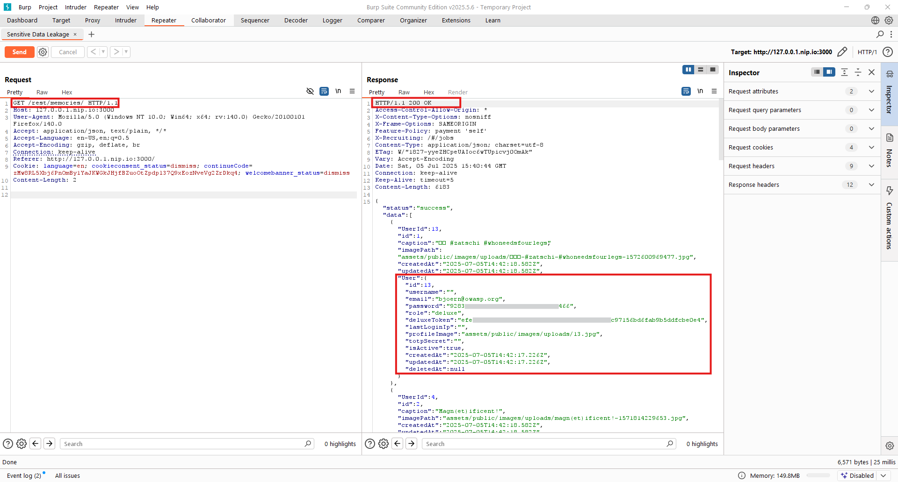

# Sensitive Data Leakage (OWASP Juice Shop)

## Description
During testing, the application exposed sensitive user information including **plaintext passwords** and **deluxe tokens** in API responses from the `/rest/memories` endpoint. This critical vulnerability allows attackers to harvest user credentials and authentication tokens directly from API responses.

---

## Environment & Tools
- OWASP Juice Shop (local or Docker): `docker run --rm -p 3000:3000 bkimminich/juice-shop`
- Burp Suite (Community Edition)
- Browser configured to proxy through Burp Suite (`127.0.0.1:8080`)

---

## Steps to Reproduce
1. Start Juice Shop and confirm it's reachable at `http://localhost:3000`.
2. Configure Burp Suite to intercept HTTP traffic.
3. Navigate to the **Memories** section of the application or call the endpoint directly in Burp **Repeater**.
4. Send a GET request to the memories endpoint:
    ```http
    GET /rest/memories HTTP/1.1
    Host: 127.0.0.1:3000
    ```
5. Observe the JSON response containing sensitive user data including:
   - Plaintext passwords (e.g., "password": "0Y8s")
   - Deluxe tokens (e.g., "deluxeToken": "4*e...")
   - Email addresses and usernames
   - Profile image paths and timestamps

---

## Proof of Concept


---

## Impact
- **Critical**: Exposure of plaintext passwords allows immediate account compromise.
- **High**: Deluxe tokens can be used for privilege escalation and unauthorized access.
- Enables credential harvesting for multiple user accounts.
- May lead to full application compromise and lateral movement.
- Violates fundamental security principles of data protection.

---

## Business & Security Risk
- Violates OWASP Top 10 (A02:2021 – Cryptographic Failures) and (A01:2021 – Broken Access Control).
- **Critical Risk**: Plaintext password exposure creates immediate security breach.
- Exposes authentication tokens that can be leveraged for account takeover.
- Risks severe regulatory non-compliance (GDPR, PCI-DSS) due to credential exposure.
- Could result in massive data breach affecting all application users.

---

## Remediation & Mitigation
1. **Immediate**: Remove plaintext passwords from all API responses.
2. **Critical**: Implement proper data transfer objects (DTOs) to filter sensitive fields.
3. Ensure authentication tokens are never exposed in API responses.
4. Implement proper access controls on the `/rest/memories` endpoint.
5. Hash passwords using strong algorithms (bcrypt, Argon2) and never store plaintext.
6. Regular security audits of API responses to prevent sensitive data leakage.
7. Implement response filtering middleware to sanitize all API outputs.

---

*Report generated on July 5, 2025.*